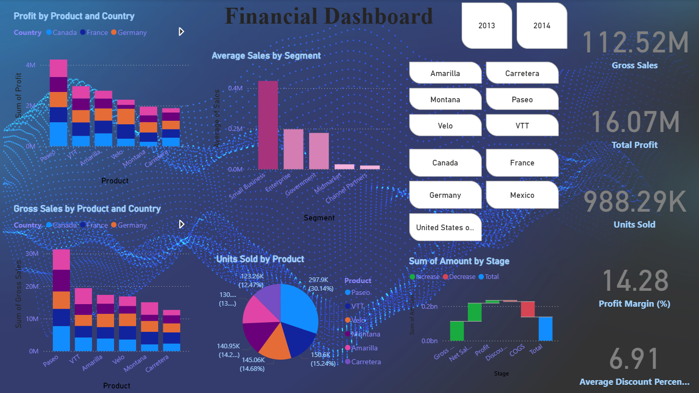

# 💼 Financial Dashboard (Power BI Project)



## 📊 Overview

This repository showcases an interactive **Financial Dashboard** created using **Power BI**. It provides a clear visualization of business performance metrics such as gross sales, total profit, units sold, average discounts, and more, using dynamic charts and slicers. The data is sourced from an Excel file and analyzed across different countries, products, and customer segments.

> 📝 **Note**: This dashboard was developed as part of my internship project and serves as a real-time example of my ability to handle business intelligence tasks using Power BI.

---

## 📁 Project Structure

```

📦 Financial-Dashboard/
├── 📊 Financial Dashboard.pbix      # Power BI dashboard file
├── 📈 Financials.xlsx               # Source Excel dataset
├── 🖼️ Dashboard.png                  # Preview image of the dashboard
└── 📄 README.md                      # Project documentation

````

---

## 💡 Key Features

- **Gross Sales & Total Profit Analysis**
  - Bar charts segmented by **Product** and **Country**.
  - Total gross sales: **112.52M**, total profit: **16.07M**.

- **Product Performance**
  - Pie chart for **Units Sold by Product**.
  - Bar charts for sales & profit comparison across various **product lines**.

- **Customer Segment Insights**
  - Column chart showing **average sales per customer segment** (Small Business, Enterprise, etc.).

- **Country & Product Filtering**
  - Slicers to filter data by **Year**, **Product**, and **Country**.

- **Profit Margin & Discount**
  - KPIs showing:
    - **Profit Margin**: 14.28%
    - **Average Discount %**: 6.91%

- **Waterfall Chart**
  - Shows breakdown of financial metrics by **Stage**: Net Sales, Profit, Discounts, COGS, and Total.

---

## 🧰 Tools Used

- **Power BI Desktop**
- **Excel (as data source)**
- **DAX** for calculated measures
- **Slicers & Filters** for interactivity

---

## 🚀 How to Use

1. Clone this repository or download it as a ZIP:
   ```bash
   git clone https://github.com/your-username/financial-dashboard.git
````

2. Open `Financial Dashboard.pbix` in **Power BI Desktop**.

3. Ensure that `Financials.xlsx` is in the same directory (if not, relink the data source in Power BI).

4. Explore the dashboard using slicers and charts.

---

## 📌 Internship Note

This project was created as part of my internship to demonstrate data visualization and business intelligence capabilities using Power BI. It reflects real-world scenario handling, analytical thinking, and dashboard creation from raw data.

---

## 📷 Dashboard Preview

See full dashboard screenshot:


---

## 📬 Contact

If you have any questions, feedback, or collaboration ideas:

* 📧 Email: \[[your-email@example.com](mailto:your-email@example.com)]
* 💼 LinkedIn: \[your-linkedin-profile]

---

## 📝 License

This project is open-source and available under the [MIT License](LICENSE).

---

## 🙋‍♀️ Author

Developed by **Marmik Gandhi** Feel free to connect:  
- GitHub: [@MarmikGandhi](https://github.com/MarmikGandhi)
- Email: [marmikgandhi@gamil.com](mailto:marmikgandhi@gamil.com)
- LinkedIn: [marmik-gandhi](https://www.linkedin.com/in/marmik-gandhi-006a55323/)

